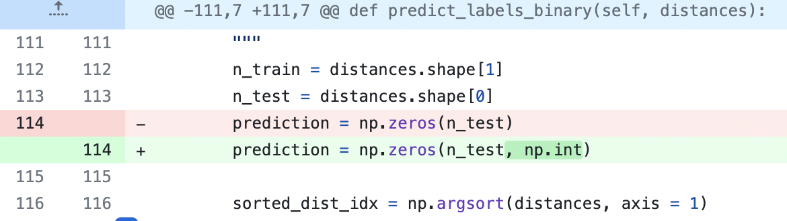

# 1. EDA
## 1.1
Отличная идея убрать оси!

## 1.2
Супер! Вопросов нет

## 1.3
Вопросов нет, сплит реализован корректно

## 1.4 KNN

Круто реализован подход без циклов! Очень оригинально :) Но он работает медленнее, чем подход с одним циклом, практически в два раза, исходя из замеров.

Предсказания для классов реализованы правильно. Но можно сделать это в векторном виде сразу для всего `X`. Как? Подсказка - заменить операциями из нампая цикл в `predict_labels_binary`.

Также у тебя этот коммит все испортил и либо повредил обратные совместимости (ты не указала, какую версию нампая сттавить и я проверяю на своей), код падает с ошибкой на `prediction = np.zeros(n_test, np.int)`, тут ошибка и она все ломает (коммит `c4989a6`):



По правилам, я должен отдать тебе сразу работу, чтобы ты ее досдала с 50% баллами. Но я посмотрел на твой код и он написан правильно, и правильнее в нампае сразу указывать, какой битности инт использовать - np.int32 или np.int64. Но ты можешь и просто указать `int` как тип данных, нампай сам разберется. Поэтому я сниму балл за то, что код сразу не работал. Если такой код ушел бы непроверенным или без указания зависимостей на реальном проекте, то могло поломаться что-то очень важное в не самое нужное время.

Метрики для бинарной классификации реализованы не до конца правильно. 
- В первом условном операторе лишнее первое условие, так как метрика нам просто считает полученные на вход массивы. Я бы сделал отдельные функции, которые обрабатывают кейсы, которые там описаны. 
- Условие с recall неполное, так как знаменатель может быть нулевым.
- Условие в f-score тоде лишнее, все бы уложилось в одно простое вычисление с проверкой знаменатея на 0.

Поэтому за метрики снимаю балл.

**При передаче аргументов в функции лучше не делать пробелов между `=` - путает синтакстс, как будто присваиваешь значение.**


Отличный ход с рисованием по линейной сетке! Но по-хорошему тогда другие графики тоже было бы хорошо привезти к похожему масштабу, не говорю, что нужно тоже прогонять по сетке все функции по поиску оптимального количества соседей, но просто тоже взять 10, 20, ..., 200. Чтобы все графики можно было без проблем сравнивать. Унифицированность - благо! Но в целом, я бы остановился на k~20 (те, где тестовый график еще не начал падать). 


## 1.5 Multiclass KNN
Тут то же самое - из-за неоптимальной реализации код работает очень медленно, и отговорка "я напишу код6 но не буду исполнять" ни на работе, ни тем более в домашке (где ты учишься писать хороший и воспроизводимый код) не пройдет. Основная проблема - в том, как ты реализовываешь предсказание - боттлнек именно здесь. Поэтому оправдание с компьютером не пройдет. 

Этот ноутбук можно спокойно загрузить в гугл колабе, и туда код перенести совсем не сложно. А запуск на случайной выборке можеть дать совсем не очевидные результаты, в таком случая лучше делать семплирование несколько раз и оценивать средний показатель и стандартное отклонение. А в целом, значение там может и не быть k=1, это на малеьнок выборке так может нам попались значения. Я перезапустил, и уменя другие получились параметры. Поэтому тут снимаю два балла, к сожалению.


# 2 EDA

## 2.1
В целом, я бы все равно перепроверял, соответствует ли описание действительнсти, так как датасеты могут обновляться, а описание нет. Классный скрипт по анализу!


## 2.2-2.4


Метрики реализованы правильно, по поводу лучшего `k` согласен!


"Чем больше значение r2, тем лучше модель описывает данные. На графике: метрика на тесте начинает падать с k=13 (падать в плане, если смотреть справа налево)
" - но на график-то мы смотрим слева направо :) Лучше так не говорить, запутывает. За Работу с пайплайном респект. Но тут на самом деле у тебя и другие категориальные столбцы могут быть, поэтому надо следать за этим, и тут советую пользоваться пандасом, чтобы отлавливать колонки, где лежат категориальные фичи:

 [`pd.DataFrame.select_dtypes`](https://pandas.pydata.org/pandas-docs/stable/reference/api/pandas.DataFrame.select_dtypes.html), советую ознакомиться! Очень выручала меня. Пример:

```{python}
cat_cols = X.select_dtypes(include="object").columns # оставит колонки со строковым типом

```

# 3 Social

Круть за тусу с одногруппниками! Поэтому +rep и допы за фоточку!


Итог:
- 1.1 - 0.5/0.5
- 1.2 - 1/1
- 1.3 - 0.5/0.5
- 1.4 - 4/6 (Ошибка, с которой сдала работу/не указала нужное окружение в случае, если у тебя ошибки не было + беспорядок в коде с метриками для бин. классификации)
- 1.5 - 0/2 (не разобралась с причиной не запуска кода)
- 2.1 - 4/4 (за пайплайн)
- 2.2 - 1/1
- 2.3 - 3/3
- 2.4 - 2/2
- 3 - 0.5

TOTAL: 16 + 0.5 / 20 = 16.5/20